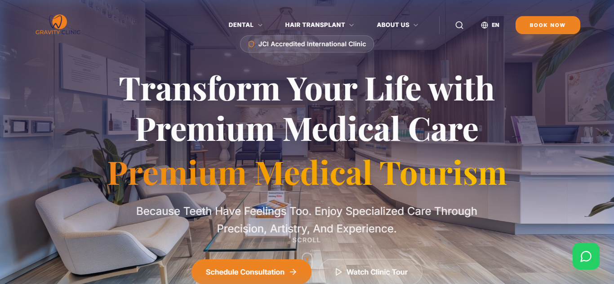
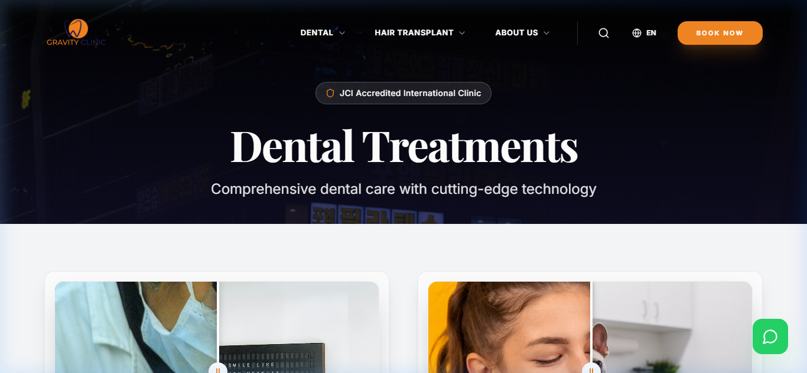
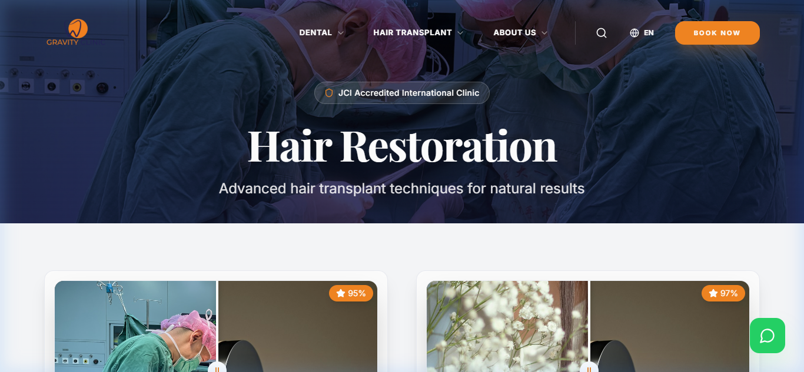
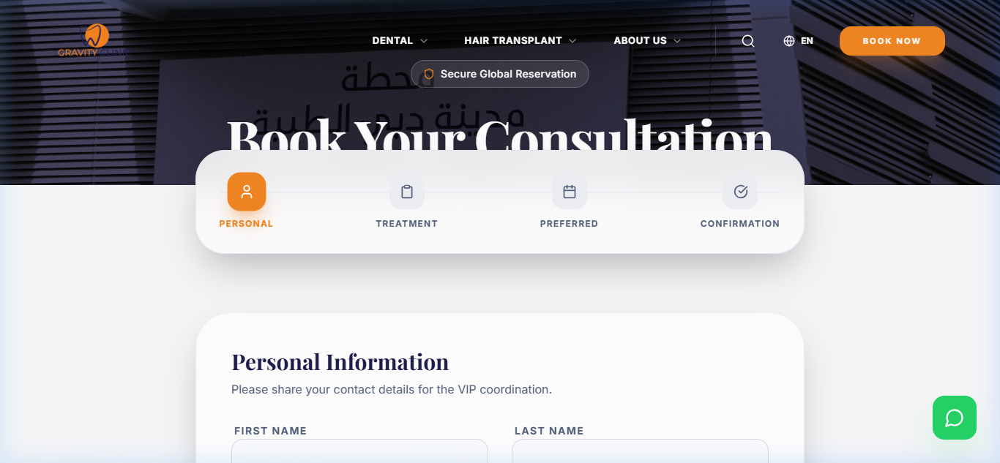
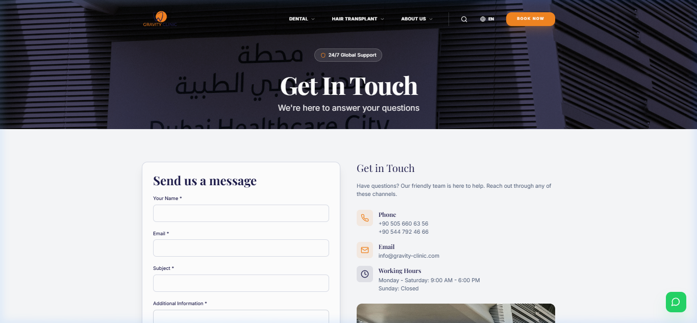

# Gravity Clinic - Initial Review Report

## Section 1: Introduction
This report provides an initial preview of the newly redesigned Gravity Clinic website. The project focuses on creating a premium, professional, and user-friendly digital presence that reflects the clinic's high standards of medical care. The new design is built with modern technologies (React, Tailwind CSS, and Framer Motion) to ensure high performance and smooth interactions.

---

## Section 2: Screenshots Preview

### 1. Homepage (Hero & Main Section)
The homepage features a striking hero section with high-quality imagery and clear calls to action. It sets a professional tone and immediately communicates the clinic's core value proposition.

### 2. Dental Services Page
A dedicated page for dental treatments, showcasing services with clean layouts and easy-to-read information.

### 3. Hair Transplant Page
The hair restoration page focuses on advanced techniques and natural results, designed to build trust with potential patients.

### 4. Online Booking System
A streamlined, step-by-step booking process that makes it easy for patients to schedule their consultations.

### 5. Contact & Support
A clear and accessible contact page with multiple ways to reach out, ensuring a smooth communication channel for clients.

---

## Section 3: Key Features
- **Modern Design**: A clean, premium aesthetic that aligns with global healthcare standards.
- **Multi-language Support**: Fully localized for English, Arabic, French, and Russian.
- **Responsive Layout**: Perfect viewing experience on desktops, tablets, and smartphones.
- **Smooth Animations**: Subtle micro-interactions and transitions for a premium feel.
- **Improved UI/UX**: Simplified navigation and intuitive user flows.

---

## Section 4: Improvements Made
- **Better Layout and Spacing**: Optimized use of white space to improve content hierarchy and focus.
- **Improved Colors and Readability**: A curated color palette that enhances brand identity and ensures accessibility.
- **Enhanced Navigation**: A more logical and accessible menu structure.
- **Added Animations and Interactivity**: Engaging elements that make the website feel alive and responsive.

---

## Section 5: Notes for Client
- This is an **initial version** designed for your early feedback.
- We are open to adjustments regarding colors, imagery, or specific wording.
- The final version will include further performance optimizations and secondary page refinements.

**We look forward to your feedback!**
